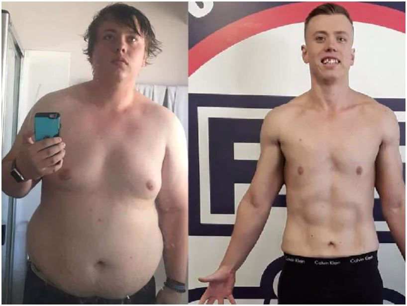

<!DOCTYPE html>
<html>
<head>
	<meta charset="utf-8">
	<meta name="viewport" content="width=device-width, initial-scale=1">
	<meta name="author" content="Ali Iktider Sayam">
	<meta name="description" content="Online Health & Fitness Guide">
	<meta name="keywords" content="gym,fitness,Healthy,Health">
	<title>Healthy Happenings</title>
	<link rel="stylesheet" href="bootstrap-4.3.1-dist/css/bootstrap.min.css">

	<link href="home.css" rel="stylesheet">
	<link rel="icon" href="logo.ico">
	
	
</head>
<body data-spy="scroll" data-target="#navbarResponsive">
	

		<nav id="navbar" class="navbar navbar-expand-md navbar-dark bg-dark fixed-top">

			<a id="logo" class="navbar-brand" href="#carouselExampleIndicators">HEALTHY HAPPENINGS</a>

			<button class="navbar-toggler" type="button" data-toggle="collapse" data-target="#navbarResponsive">
				
			</button>

			

				<ul class="navbar-nav ml-auto" style="list-style-type: none;">

					<li class="nav-item"> <a class="nav-link" href="#home">HOME</a>
				</li><li class="nav-item"><a class="nav-link" href="#offer">OFFERINGS</a>
				</li><li class="nav-item"><a class="nav-link" href="#expert">EXPERTS</a>
				</li><li class="nav-item"><a class="nav-link" href="#feedback">FEEDBACKS</a>
				</li><li class="nav-item"><a class="nav-link" href="#social">SOCIAL-MEDIA</a>
				</li><li class="nav-item"><a class="nav-link" href="login.php">LOGIN/SIGNUP </a>
				</li>
			</ul>

			

			
		</nav>
			
		

		

	<header id="header">
		

			<ol class="carousel-indicators">
				<li data-target="#carouselExampleIndicators" data-slide-to="0" class="active"></li>
				<li data-target="#carouselExampleIndicators" data-slide-to="1"></li>
				<li data-target="#carouselExampleIndicators" data-slide-to="2" ></li>
			</ol>

			

				<!-- slide 1  -->
				

					

						<h4>Welcome to</h4>
						<h1>HEALTHY HAPPENINGS</h1>
						
"For me life is continuously being hungry.  The meaning of life is not simply to exist, to survive, but to move ahead, to go up, to achieve, to conquer."   
						- Arnold Schwarzenegger

						<a class="btn btn-outline-light btg-lg" href="login.php">GET STARTED WITH HEALTHY HAPPENINGS</a>
					

				
<!-- slider -->

				<!-- slide 2 -->

				

					

						<h1>HEALTH IS ALL WE NEED</h1>
						
"The foundation of success in life is good health: that is the substratum fortune; it is also the basis of happiness.  A person cannot accumulate a fortune very well when he is sick."   
-P. T. Barnum

					

				

				<!-- 3rd slide -->

				

					

						<h1>!!!WORK HARD!!!</h1>
						
“You dream. You plan. You reach.  There will be obstacles. There will be doubters. There will be mistakes.   But with hard work, with belief, with confidence and trust in yourself and those around you, <b> there are no limits</b>.”

					

				

			
	<!-- end carousel inner -->
		
 <!-- end of home -->
	</header>

	<main>

		

		

			

				<h1 style="color: white; text-shadow: .1rem .1rem .7rem white;" class="heading">Why be healthy?</h1>
				

				
1.	To live longer: Who doesn’t love to live longer? Everybody does. And to do so, there’s no other option other than having a healthy lifestyle. A study shows that, people who maintain a healthy lifestyle (having a healthy diet, taking physical exercise, avoiding alcohol etc.)  can live up to 14 years more than those who don't maintain a healthy lifestyle! You surely would love to live more, right?  
2.	To thrive, not to survive: Let's be honest. Living to 100 years really isn't worth it if you are, at that age, bedridden or unable to enjoy your old life or unable to enjoy your time with your grandchildren. Cherish the life you have, enjoy every single moment. And to do so, stay healthy!  
3.	For gaining confidence: Those who work out regularly knows how good it feels after completing a long run, or doing 50 push ups, or completing all the sets of biceps workout properly. It gives a huge amount of confidence which surely will reflect on your other works of your daily life. Having a fit body, a healthy body can change your whole life, your attitude. Go for that!  
4.	To have a better mental health: A study conducted by researchers of Duke University shows that exercising for 30 minutes 3 times a week can help an estimated 60% of patients overcome their depression without taking any anti-depressant medication. We have been hearing from our very childhood that – a sound mind in a sound body! So who doesn’t want to have a sound and better mental health?  
5.	Avoiding illness and keeping medical cost down: Having a good lifestyle (having good food and taking exercise) can reduce free radicals as well as promote the release of toxins associated with diseases and illness. So, a good health will allow you to be disease free. In addition, this whole thing will help you to keep your medical costs down. Because if you are not healthy, you will catch diseases. And if you catch diseases, you will have to go to hospital and take medical assistance which will cost you money. So, in order to avoid all these, stay healthy!  

			

		

		

		

		

			

				

				<h1 class="heading" style="text-shadow: .1rem .1rem .7rem white;">HOW WE AIM TO CHANGE YOUR LIFE</h1>
				

				
1. Experienced trainers: We will provide you with experienced and trained S&C trainers who will always be there to guide you whenever you need their guidance. Our trainers themselves are trained from all across the world and are ready to train you guys.  
2. Diet tips: Maintaining a healthy and balanced diet is quite hard nowadays. Most of the people are not satisfied with their diets and thus they themselves complain about their diet. There's nothing to be tensed about this! We are there for you to provide you with the best diet for you according to your age, height, weight and overall physique.  
3. Exercise plan: Along with having a good diet, it's very important to do regular physical exercise. We can see people around us having exercise regularly, but don't see any improvements. It is because they do physical exercise, but they don't do it according to any proper plan or routine. If you exercise without any proper plan, it will bring no benefit. So, our expert trainers are here to provide you with a proper plan for taking exercise which surely will help you to improve.  
4. Lifestyle suggestions: Maintaining a good health doesn't only depend on exercise or diet, it also depends on the daily lifestyle. In this age, everyone is busy doing their other works. Thus, it has become quite hard to maintain a healthy lifestyle. Therefore, we are here to provide you with a good and healthy lifestyle routine from our experts keeping your other works in mind.  
5. Exciting packages: We are here to provide exciting packages at the best rate you will find in the whole market. You will find various kinds of packages according to your need. For example: 
•	Monthly packages: Our trainers will provide you with a routine of one whole month and will contact with you at the end of the month and take update about your health and physique. They will give you suggestions if needed.  
•	Semi-Annual packages: If you get this package, our experts will contact with you after each 6 months and supervise your overall physique and health. After doing so, they will provide you with all the guidance you need. 
•	Annual packages: If you have to consider the money factor, then this package is for you. Our trainers will get to you after one year and will have a conversation with you about your experience of the whole year. Then they will give you more tips and suggestions as you need them. 
Like this, there are various more packages which are worth trying. For more details, contact with us and find the most appropriate package for you. Have a HEALTHY LIFE & stay HAPPY!

				

			

		

		
			

				

				<h1 style="color: white; text-shadow: .1rem .1rem .7rem white;" class="heading">THE BEST CERTIFIED TRAINERS  TO GUIDE YOU ON YOUR JOURNEY</h1>
				

					

						

							

								
									

										<h3>JEFF CAVALIERE</h3>
										<h4 style="text-align: center;">Accomplishments</h4>
										

											<h5>Certifications</h5>
											
BA Physioneurobiology – University of Connecticut

											
Physical Therapy Masters Degree – University of Connecticut

											
Strength & Conditioning Specialist – NSCA
  
											<h5>Experience</h5>
											
Head Physical Therapist & Assistant Strength Coach – New York Mets 

											
Writer for Men’s Fitness

											
Founder of fitness company

										

									

							

						

						

							

								
									

										<h3>SCOTT HERMAN</h3>
										<h4 style="text-align: center;">Accomplishments</h4>
										

											
Winning ‘Iron Abs’

											
YouTube Celebrity

											
Strength & Conditioning Specialist

											
Founder of fitness company

										

									

							

						

					

				

			

		

		

		

			

				<h1 class="heading">Testimonials</h1>
				

				

						

							

								
									

										<h3>Sam</h3>
										<h4 style="text-align: center;">FROM FAT TO FIT</h4>
										

											 
											
Life has been tough. As a fat guy, moving around and doing just about anything was super tough for me. But thanks to the experts and amazing support of HEALTHY HAPPENINGS, I am fit now. And I never had to look back! 

											
										

									

							

						

						

							

								
									

										<h3>Jacob</h3>
										<h4 style="text-align: center;">FROM SKINNY TO FIT</h4>
										

											
Being a skinny man was tough to start with, much like being a fat guy I never had any real strength, Untill I found out about HEALTHY HAPPENINGS! They changed my life for the better.

										

									

							

						

					

			

		

		

		

		

			

				<h1 style="color: white; text-shadow: .1rem .1rem .7rem white;c" class="heading">CHECK US OUT!</h1>
				

				<a href="https://www.facebook.com/Healthy-Happenings-101037867932740/" target="_blank"> <i class="fab fa-facebook-square"></i></a>
				<a href="https://www.instagram.com/healthyhappenings__/" target="_blank"> <i class="fab fa-instagram"></i></a>
			

		

		

	</main>

	<footer>
		
		

			<h4 style="color: floralwhite;border-bottom: 4px solid rgba(255, 238, 0,.6);">CONTACT US</h4>
			

				
			
				<a class="footerdes" href="#">Healthy Happenings</a> 
				<a class="footerdes" href="#">healthyh@gmail.com</a> 
				<a class="footerdes" href="#">+88 01XXX-XXXXXX</a> 
			
		

		

		

		&copy; HealthyHappenings.
	</footer>

	
	
	
	
	<!-- smooth scroll -->
	
	
</body>
</html>
